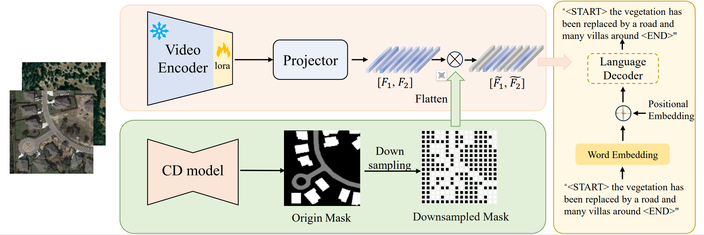

# MV-CC: Mask Enhanced Video Model for Remote Sensing Change Captioning

**Authors**: Ruixun Liu\*, Kaiyu Li\*, Jiayi Song\*, Dongwei Sun, Xiangyong Cao  
\*Equal contribution  
[[arXiv Paper](https://arxiv.org/abs/2410.23946)]

<p align="center">
  
</p>

---

## 🚀 Overview

This repository contains the official implementation of **MV-CC**, a mask-enhanced video model for change captioning in remote sensing. The code was originally published by the authors but had multiple issues and poor documentation.  
This version has been **refactored and fixed** to ensure a smoother user experience.

Now, all you need to do is:

1. Clone the repo
2. Install the requirements
3. Download the dataset

The scripts will take care of the rest.

---

## 📦 Setup Instructions

### 1. Environment Setup

It is recommended to use Python 3.9 in a virtual environment.

```bash
conda create -n mv_cc_env python=3.9
conda activate mv_cc_env
pip install -r requirements.txt
```

Make sure to install [JDK 11 or higher](https://www.oracle.com/tr/java/technologies/downloads/) if not already installed.

---

### 2. Download Dataset

We use the [LEVIR-MCI](https://github.com/Chen-Yang-Liu/Change-Agent) dataset. You can download it directly from this [Hugging Face link](https://huggingface.co/datasets/lcybuaa/LEVIR-MCI/tree/main).

The dataset folder should follow this structure:

```
LEVIR-MCI-dataset/
├── LevirCCcaptions.json
└── images/
    ├── train/
    │   ├── A/
    │   ├── B/
    │   ├── label/
    │   ├── label_rgb/
    │   ├── semi_mask/          ← generated later
    │   ├── supervised_mask/    ← generated later
    │   └── video_data/         ← generated later
    ├── val/
    │   └── ...
    └── test/
        └── ...
```

- `A/`: pre-phase images
- `B/`: post-phase images
- `semi_mask/`: generated from 5% semi-supervised labels
- `supervised_mask/`: generated from full supervision
- These masks can be generated using the [SemiCD repository](https://github.com/wgcban/SemiCD)

---

### 3. Data Preparation

After downloading the dataset, run the following scripts:

```bash
python preprocess_data.py
python generate_MP4.py
```

This will:

- Generate video data
- Organize dataset folders

---

### 4. Download Pretrained Models

- Download `video_encoder.pth` from this [Google Drive folder](https://drive.google.com/drive/folders/1oZVFSugnaSMSXzSWi_9Z4HYgN7k706VO?usp=sharing), **remove the "Copy of" from the filename**, and place it inside the `checkpoints/` directory.

> ❗ Note: The original [Baidu link](https://pan.baidu.com/s/1Gd_qykQKy65K6aHSdh5u9A?pwd=t6jk) may not be accessible outside China.

- To download the large language-vision model used in captioning:

```bash
python download_model.py
```

This will fetch the [InternVideo2_Chat_8B_InternLM2_5](https://huggingface.co/OpenGVLab/InternVideo2_Chat_8B_InternLM2_5) model and place it in the required folder.

---

## 🏋️‍♂️ Training

Once the setup and data preparation are done, train the model with:

```bash
python train_video_sty.py
```

> ⚠️ If you encounter an error such as `'Meteor' object has no attribute 'lock'`, make sure Java is correctly installed:

```bash
sudo apt install openjdk-11-jdk
```

Alternatively, pretrained models are available at the same [Google Drive link](https://drive.google.com/drive/folders/1oZVFSugnaSMSXzSWi_9Z4HYgN7k706VO?usp=sharing).

---

## 📝 Caption Generation

To generate change captions on the test set:

```bash
python test_video_sty.py
```

---

## 🧠 Mask Modes

You can specify the mask mode using the `--mode` argument:

| Mode              | Description               |
| ----------------- | ------------------------- |
| `semi_mask`       | 5% semi-supervised method |
| `supervised_mask` | Fully supervised mask     |
| `label`           | Ground truth labels       |

Example:

```bash
python train_video_sty.py --mode supervised_mask
```

---

## 📄 Citation

If you use this work in your research, please cite:

```bibtex
@misc{liu2024mvccmaskenhancedvideo,
  title={MV-CC: Mask Enhanced Video Model for Remote Sensing Change Caption},
  author={Ruixun Liu and Kaiyu Li and Jiayi Song and Dongwei Sun and Xiangyong Cao},
  year={2024},
  eprint={2410.23946},
  archivePrefix={arXiv},
  primaryClass={cs.CV},
  url={https://arxiv.org/abs/2410.23946}
}
```

---

## 🙏 Acknowledgements

- [LEVIR-MCI Dataset](https://github.com/Chen-Yang-Liu/Change-Agent)
- [SemiCD Repository](https://github.com/wgcban/SemiCD)
- [OpenGVLab’s InternVideo2](https://huggingface.co/OpenGVLab/InternVideo2_Chat_8B_InternLM2_5)

---

## 📜 License

This project is licensed under the [MIT License](LICENSE.txt).  
**Note:** This code is intended for academic and research use only.
